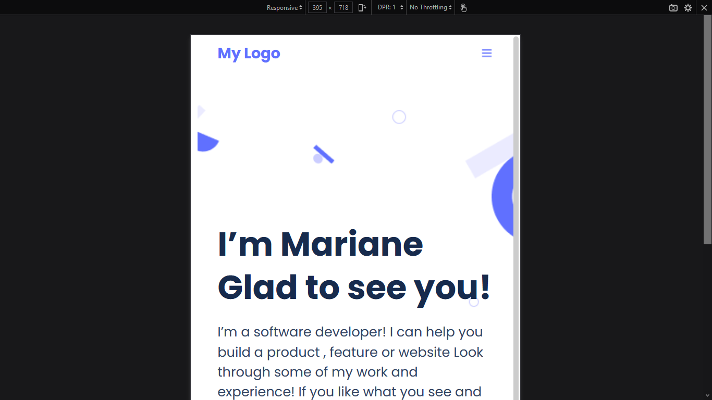

# My Portfolio

> It's a basic portfolio website with all features 



## Built With

- HTML & CSS
- Github workflow
- Linters(Lighthouse, stylelint, Webhint)

## Live Demo

[Live Demo Link](https://emirsagit.github.io/my-portfolio/)


## Getting Started

To get a local copy up and running follow these simple example steps.

``` git clone https://github.com/emirsagit/my-portfolio.git ```

``` cd my-portfolio ```

## Authors

👤 **Emir Sağıt**

- GitHub: [@emirsagit](https://github.com/emirsagit)
- Twitter: [@emirsagit](https://twitter.com/emirsagit)
- LinkedIn: [Emir Sağıt](https://www.linkedin.com/in/emir-sa%C4%9F%C4%B1t-633035188/)

## 🤝 Contributing

Contributions, issues, and feature requests are welcome!

Feel free to check the [issues page](../../issues/).

## Show your support

Give a ⭐️ if you like this project!

## 📝 License

This project is [MIT](./MIT.md) licensed.
